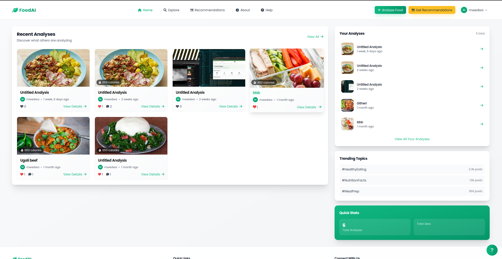
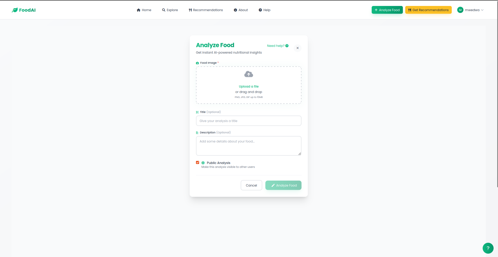
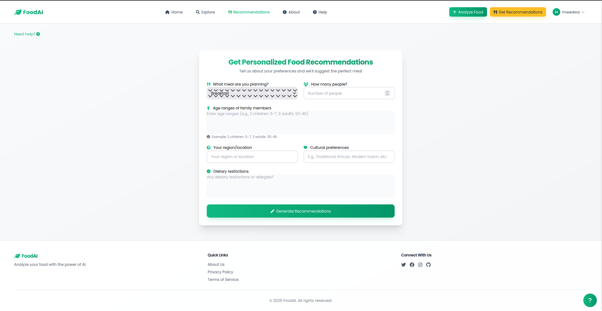

# FoodAI - AI-Powered Food Analysis Platform
 

FoodAI is a modern web platform that leverages artificial intelligence to analyze food images, providing detailed nutritional information, ingredient detection, and personalized meal recommendations.

## ✨ Features

### 🍽️ Food Analysis

- **Image Recognition**: Upload photos of your meals and let AI identify the food
- **Nutritional Breakdown**: Get detailed calorie counts and nutritional information
- **Ingredient Detection**: Automatically identify ingredients in your food
- **Analysis History**: Track your eating patterns over time

### 🧠 Smart Recommendations

- **Personalized Suggestions**: Receive meal recommendations based on your preferences
- **Dietary Accommodation**: Support for various dietary needs (vegetarian, vegan, gluten-free, etc.)
- **Cultural Preferences**: Filter recommendations by regional cuisine
- **Family-Sized Options**: Scale recipes for different group sizes

### 👥 Community Features

- **Public/Private Sharing**: Choose whether to share your food analyses
- **Like & Comment**: Interact with other users' food posts
- **User Profiles**: Customize your profile with a photo and bio
- **Explore Feed**: Discover popular food analyses from the community

## 🚀 Getting Started

### Prerequisites

- Python 3.8+
- pip
- virtualenv (recommended)

### Installation

1. Clone the repository:

   ```
   git clone https://github.com/yourusername/foodai.git
   cd foodai
   ```

2. Create and activate a virtual environment:

   ```
   python -m venv env
   source env/bin/activate  # On Windows: env\Scripts\activate
   ```

3. Install dependencies:

   ```
   pip install -r requirements.txt
   ```

4. Set up environment variables:

   ```
   cp .env.example .env
   # Edit .env file with your configuration
   ```

5. Run migrations:

   ```
   python manage.py migrate
   ```

6. Create a superuser:

   ```
   python manage.py createsuperuser
   ```

7. Start the development server:

   ```
   python manage.py runserver
   ```

8. Visit `http://127.0.0.1:8000/` in your browser

## 📱 Screenshots

<div style="display: flex; flex-wrap: wrap; gap: 10px; justify-content: center;">
    
    <!-- Home Page -->
    
    <!-- Analysis Page -->
    
    <!-- Analysis Detail -->
    
    <!-- Recommendations -->
    
    <!-- Explore Page -->
    
    <!-- Profile Page -->
    
    <!-- Login Page -->
    
</div>

## 🧪 Technologies Used

- **Frontend**: HTML5, CSS3, TailwindCSS, Alpine.js
- **Backend**: Django, Python
- **AI**: genai
- **Database**: PostgreSQL 

 
## 📄 License

This project is licensed under the MIT License - see the [LICENSE](LICENSE) file for details. 